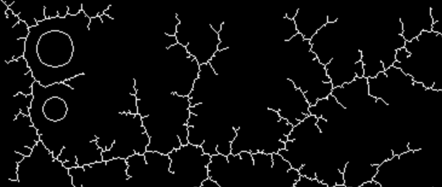

## Overview

Source for building this site can be found at [https://github.com/miguelsimon/steering](https://github.com/miguelsimon/steering).

This is mainly an exercise to teach myself cmake and C++.

## Rapidly exploring random trees

[Rapidly exploring random trees](https://en.wikipedia.org/wiki/Rapidly-exploring_random_tree) are one of the coolest ideas ever, [the paper by LaValle](http://msl.cs.uiuc.edu/~lavalle/papers/Lav98c.pdf) is excellent. They allow the statement and solution of extremely broad classes of planning problems.

* [demo_trivial_rrt.html](demo_trivial_rrt.html) Builds a trivial RRT in 2 dimensions.
* [demo_collision_rrt.html](demo_collision_rrt.html) Attempt to steer a circular actor to a goal, avoiding collisions with obstacles.
* [demo_rotation_rrt.html](demo_rotation_rrt.html) Attempt to steer a bar with 3 degrees of freedom (2 spatial dimensions + rotation) into a goal

## Steering behaviours

A few [steering behaviours](https://www.red3d.com/cwr/steer/gdc99/) implemented in C++ and compiled to WebAssembly.

* [demo_seek.html](demo_seek.html) Seek steering behaviour, note oscillations when goal is reached.
* [demo_arrive.html](demo_arrive.html) Arrive behaviour, no oscillations :)
* [demo_waypoint.html](demo_waypoint.html) Simple waypoint following.
* [demo_wander.html](demo_wander.html) Wander steering behaviour.
